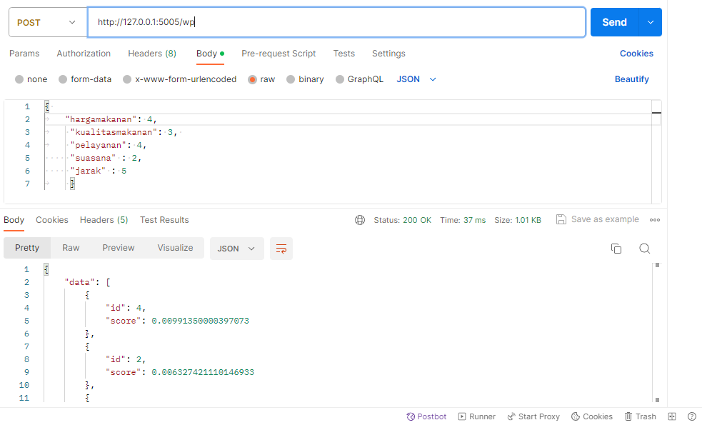

# UAS spk_web

## Install requirements

    pip install -r requirements.txt

## Run the app
to run the web app simply  use

    python main.py

## Usage
Install postman 
https://www.postman.com/downloads/

get ponsel list

get recommendations saw

get recommendations wp

### TUGAS UAS
Implementasikan model yang sudah anda buat ke dalam web api dengan http method `POST`

INPUT:
    { 
	"hargamakanan": 3,
	 "kualitasmakanan": 3, 
	 "pelayanan": 4,
     "suasana" : 2,
     "jarak" : 5
	 }

OUTPUT (diurutkan / sort dari yang terbesar ke yang terkecil):

post recommendations saw

post recommendations wp

